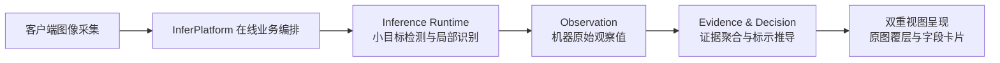

# 轻眸识刻

> 面向消费者、商超与仓储场景的食品包装日期智能识别原型系统
>
> **工程状态**：全域处于架构规范与 M0 核心原型攻坚阶段 · 单图闭环推进中 · 遵循单一事实来源

轻眸识刻聚焦食品包装上微小、模糊、反光及位置不规则的日期信息，采用小目标视觉检测、局部受限字符识别与语义推导技术构建全链路方案。系统输出限定为**食品包装标示状态**，不替代专业食品安全检测，不向用户直接断言食品绝对可食用结论。

---

## 核心挑战与技术突破

食品包装日期常分布于瓶盖、瓶底、封口或标签角落，极易受点阵断笔、喷码磨损、曲面变形与反光干扰；且需精准关联生产日期、保质期限与到期日。系统建立双重可信输出机制：信息完备时输出推导结论；关键信息缺失、冲突或低置信度时，主动输出结构化复核状态，避免误导决策。

---

## 阶段规划与处理主线

当前工程优先推进 Web M0 单图主链路验证：完成单图上传、检测框定位、局部文本识别、结构化证据提取与标示状态决策。多图时间线聚合、跨图一致性推导与人工纠偏作为后续 C0 目标递进展开。移动端与小程序端作为生态储备，统一复用后端在线能力。

- **目标定位与识别**：研发小目标检测网络与微型字符识别算法，支持点阵码、激光码与印刻字符的局部增强与精准解码。
- **语义解析与决策**：依据法定日历规则推导包装标示期限，输出“在期 / 临期 / 超期 / 无法判定”四种标示状态，并独立附带证据链复核指引。
- **质量闭环与纠偏**：客户端支持字段级人工纠偏，即时更新业务决策；同时由训练治理平台审核后，受控纳入离线样本资产。

---

## 系统仓库矩阵与协同导航

组织维护由规范中枢、核心服务、算法执行与多端呈现构成的 8 仓矩阵，所有仓库职责边界保持独立：

| 仓库名称 | 架构定位 | 核心工程职责 |
| :--- | :--- | :--- |
| [ProjectPRD](https://github.com/QingMouFoodDate/ProjectPRD) | 全域规范中枢 | 维护需求规格、架构设计、跨仓契约标准与质量红线 |
| [InferPlatform](https://github.com/QingMouFoodDate/InferPlatform) | 在线服务中枢 | 承接多端 API、会话编排、内部推理运行时适配与即时决策生成 |
| [TrainPlatform](https://github.com/QingMouFoodDate/TrainPlatform) | 训练治理中枢 | 管理样本资产、数据集版本冻结、标注审核留痕与模型生命周期 |
| [ModelTrain](https://github.com/QingMouFoodDate/ModelTrain) | 算法研发中心 | 负责视觉算法实现、模型训练评测、消融实验与标准模型包导出 |
| [WebClient](https://github.com/QingMouFoodDate/WebClient) | Web 原型系统 | 大创核心交付成果，实现单图识别验证、双重视图呈现与交互原型 |
| [MobileClient](https://github.com/QingMouFoodDate/MobileClient) | 移动端客户端 | 规划现场拍摄稳态辅助、微距引导与离线食品台账设计储备 |
| [WxClient](https://github.com/QingMouFoodDate/WxClient) | 微信小程序端 | 规划长辈大字关怀模式、免安装查验通道与社交卡片设计储备 |
| [.github](https://github.com/QingMouFoodDate/.github) | 组织全局配置 | 维护组织公开主页、全域导航体系与通用开源工程规范 |

Inference Runtime 作为 InferPlatform 内部逻辑模块协同运行，实现推理与业务的高内聚低耦合。

---

## 核心契约与单一事实源

全域设计、数据模型与接口规范以 ProjectPRD 为单一事实来源（SSOT）：

| 规范维度 | 事实源契约 | 核心约束说明 |
| :--- | :--- | :--- |
| **系统边界与架构** | [需求规格](https://github.com/QingMouFoodDate/ProjectPRD/blob/main/需求规格.md) · [系统架构](https://github.com/QingMouFoodDate/ProjectPRD/blob/main/系统架构.md) · [开发路线](https://github.com/QingMouFoodDate/ProjectPRD/blob/main/开发路线.md) | 确立系统功能边界、8 仓架构分层与 M0 迭代里程碑 |
| **跨仓接口与数据** | [在线接口契约](https://github.com/QingMouFoodDate/ProjectPRD/blob/main/contracts/在线接口契约.md) · [核心数据模型](https://github.com/QingMouFoodDate/ProjectPRD/blob/main/contracts/核心数据模型.md) · [openapi.json](https://github.com/QingMouFoodDate/ProjectPRD/blob/main/contracts/openapi.json) | 统一会话编排、REST 接口端点定义与 Observation/Evidence 数据模型 |
| **规则与执行契约** | [日期推导规则](https://github.com/QingMouFoodDate/ProjectPRD/blob/main/contracts/日期推导规则.md) · [模型交付规约](https://github.com/QingMouFoodDate/ProjectPRD/blob/main/contracts/模型交付规约.md) · [离线训练规约](https://github.com/QingMouFoodDate/ProjectPRD/blob/main/contracts/离线训练规约.md) | 标示状态法定决策逻辑、标准模型交付规约与样本质量准入 |

所有接口端点、机器 Schema 校验与数据传输对象均以上述规范为准。

---

## 隐私安全与工程边界

| 控制维度 | 安全规约与工程要求 | 实施机制 |
| :--- | :--- | :--- |
| **鉴权与防重放** | 在线会话通过安全令牌认证，关键操作绑定幂等键 | 敏感字段严禁写入客户端日志，防止会话重放与凭证泄漏 |
| **数据准入隔离** | 真实采集样本与用户纠偏遵循合规授权与隐私保护 | 经脱敏及双人审核通过前，严禁并入离线训练集 |
| **资产代码解耦** | 大容量图像原图与模型二进制权重严禁提交至 Git 仓库 | 统一由对象存储与模型资产库受控分发 |

